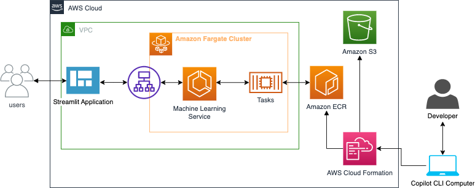

# Deploy an Machine Learning Service Quickly on Fargate using Streamlit and AWS Copilot

This repository shows show to rapidly deploy a Machine Learning ML service on Amazon Web Services (AWS) Cloud, using AWS Fargate and Streamlit.
The primary of focus of this pattern is how to get an ML service up and running quickly on AWS.
For reference, you will create a text summarization application service using the Hugging Face Transformers library.




* Machine Learning as Service
* Automated backend and deploy using the command line and AWS services
* Automated fronted using AWS Fargate and Streamlit

## Deploy using AWS Copilot
​
Copilot abstracts the creation of cloud components like VPC subnets, load balancers, deployment pipelines, and durable storage for your application’s stateful data.
See the [docs](https://github.com/aws/copilot-cli)

You can initialize the app and configure the resource requirements in the copilot application manifest.yml file by using following steps:

1. Set up the application and enviroment details. 
Execute below commands from the application home directory. Copilot prompts you through the set up of your application. 
```
copilot init
copilot env init
```
Provide details as follows:
Application Name: text-summarizer
Workload Type: Load Balanced Web Service
Service Name: text-summarizer-service
Docker File: app/DockerFile

For setting up environment:
Environment Name: demo
Environment Configuration; Yes, use default

2. Configuring the application resource in manifest.yml 
 Edit <app-home-dir>/copilot/text-summarizer-service/manifest.yml  and set below parameters to update the default settings.

 ```
cpu: 4096       # Number of CPU units for the task.
memory: 8192    # Amount of memory in MiB used by the task.
platform: linux/x86_64  # See https://aws.github.io/copilot-cli/docs/manifest/lb-web-service/#platform
count: 1       # Number of tasks that should be running in your service.
exec: true     # Enable running commands in your container.
```
3. Deploy the application
Execute below commands to start the deployment to Fargate. This will first create the Docker Image, push it to ECR and deploy it to the ECS cluster created in step 1. 

```
copilot env deploy --name demo
copilot deploy
```

### Local development
```
python3 -m venv .env
source .env/bin/activate
pip install --upgrade pip
pip install -r streamlit-ui/requirements.txt
pip install -r requirements.dev
```

To run locally inside of the virtual environment:

`streamlit run streamlit-ui/main.py --logger.level=debug`


If you want to build the image and run in locally.
```
docker build -t aws-summarizer:latest .  --platform=linux/amd64

docker run -it -p 8501:8501 aws-summarizer:latest
```

### Pushing to ECR

```
AWS_ACCOUNT_ID=$(aws sts get-caller-identity --query 'Account' --output text)
aws ecr get-login-password --region us-east-1 | docker login --username AWS --password-stdin ${AWS_ACCOUNT_ID}.dkr.ecr.us-east-1.amazonaws.com

docker build -t aws-summarizer . --platform=linux/amd64

docker tag aws-summarizer:latest ${AWS_ACCOUNT_ID}.dkr.ecr.us-east-1.amazonaws.com/aws-summarizer:latest

docker push ${AWS_ACCOUNT_ID}.dkr.ecr.us-east-1.amazonaws.com/aws-summarizer:latest
```

Build out copilot using the local image name
May need to actually select local image name to build from

```
copilot init --app text-sum              \
  --name text-sum-api                             \
  --type 'Load Balanced Web Service'     \
  —-image aws-summarizer       \
  --deploy
```

```
copilot init --app text-sum              \
  --name text-sum-api                             \
  --type 'Load Balanced Web Service'     \
  —-image aws-summarizer       \
  --deploy
```


# References

https://nicjac.dev/posts/how-to-build-machine-learning-demo-in-2022/

https://aws.amazon.com/blogs/machine-learning/part-2-set-up-a-text-summarization-project-with-hugging-face-transformers/

https://www.section.io/engineering-education/how-to-deploy-streamlit-app-with-docker/
